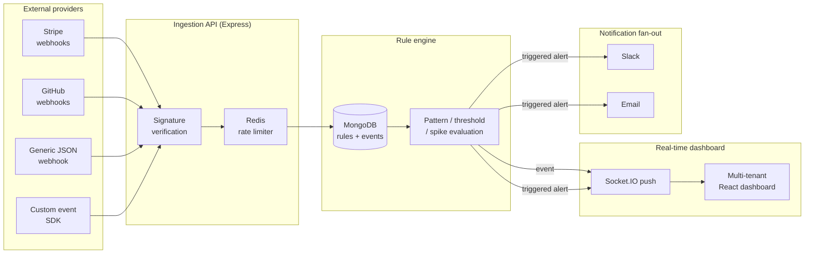

# pulseboard-ops

**Lightweight, self-hosted incident radar for early-stage startups - catch failed payments, deploy errors, and signup spikes before they die quietly in a Slack channel.**


## The real problem

Early-stage startups need to watch business-critical events - failed payments, deploy errors, signup spikes - across the tools they already use, but full observability platforms (Datadog, PagerDuty) are enterprise-priced and enterprise-shaped. So most teams wire a handful of `curl` calls into a Slack webhook and call it monitoring. Nobody owns the noise, thresholds don't exist, and incidents pile up unread until a customer complains.

pulseboard-ops is the middle ground: a small, self-hostable service that ingests events from Stripe, GitHub, and any generic JSON source (plus your own app via a tiny event SDK), evaluates them against rules you define (patterns, thresholds, spikes), and pushes triggered alerts to a live dashboard and to Slack/email - with per-tenant auth, signature-verified ingestion, and Redis-backed rate limiting so one noisy tenant can't take down another.

## Architecture



Flow in one sentence: **external providers -> signature-verified webhook ingestion + custom event SDK -> Redis rate-limit -> rule engine (MongoDB) -> Socket.IO push to a live multi-tenant dashboard, with Slack/email notification fan-out on triggered alerts.**

## Features

- **Three ingestion paths, all signature-verified**: Stripe-style (`t=,v1=` HMAC with replay-window tolerance), GitHub-style (`X-Hub-Signature-256`), and a generic JSON provider (`X-Pulseboard-Signature`) - plus a tiny [custom event SDK](sdk/pulseboardClient.js) reusing the generic scheme so your own app can `client.track('signup.created', {...})`.
- **Rule engine** (MongoDB-backed) supporting three condition types:
  - `pattern` - field-level match (`eq`, `neq`, `contains`, `gt`/`gte`/`lt`/`lte`, `regex`) against any event field, fires on the very next matching event.
  - `threshold` - "N or more matching events in the last W minutes" (e.g. 5+ failed payments in 10 minutes).
  - `spike` - current-window volume vs. a trailing baseline window, expressed as a multiplier (e.g. signups 3x above baseline).
  - Every rule supports a cooldown window so a noisy source can't spam the same alert every second.
- **Real-time multi-tenant dashboard** (React + Socket.IO): a live event feed, an alerts panel with acknowledge/resolve actions, and a rule manager - all scoped to the authenticated organization's Socket.IO room.
- **Notification fan-out** to Slack (incoming webhook) and email (SMTP via nodemailer, with a safe no-op `jsonTransport` fallback when unconfigured), dispatched per-rule based on the `channels` you configure.
- **Redis-backed rate limiting**, per API key, on every ingestion endpoint (fixed-window `INCR`/`PEXPIRE`), returning standard `X-RateLimit-*` headers and `429` once exceeded.
- **Role-based multi-tenant auth**: JWT sessions with `owner` / `admin` / `member` roles; every query is scoped to `organizationId` so tenants can never see each other's data.

## Quick start

### Run the whole stack with Docker

```bash
git clone <this-repo> pulseboard-ops && cd pulseboard-ops
JWT_SECRET=$(openssl rand -hex 32) docker compose up --build
```

- Dashboard: http://localhost:8080
- API: http://localhost:4000 (health check at `/health`)

Register an organization from the dashboard - the response includes your webhook secrets and API key, shown once.

### Run locally without Docker

```bash
# 1. Backend
cd server
cp .env.example .env        # defaults work against a local Mongo/Redis
npm install
npm run dev                 # requires a local MongoDB + Redis, or point .env at hosted ones

# 2. Frontend (separate terminal)
cd client
npm install
npm run dev                 # http://localhost:5173, proxies /api to :4000
```

### Run the tests (fully offline, no Docker/Mongo/Redis required)

```bash
cd server
npm test
```

The default suite (95 tests) never touches a real database or the network: Mongoose models are swapped for an in-memory fake store (`src/__tests__/helpers/fakeModel.js`) exercised through real Express + Supertest requests, and Redis is backed by `ioredis-mock`. An optional `npm run test:integration` suite exists for smoke-testing against a real `docker compose up -d mongo redis` stack, and is skipped automatically when those services aren't reachable.

## How it works

1.  **Ingest.** A provider POSTs to `/webhooks/:keyId/{stripe|github|generic}`, or your app calls the SDK's `track()` against `/api/events/:keyId/track`. Each request first passes a Redis-backed rate limiter keyed by API key, then a provider-specific HMAC signature check against the raw request body - using the tenant's own webhook secret, so a leaked API key ID alone is useless without the matching secret.
2.  **Normalize.** Each provider's payload is mapped into a common `{ organizationId, provider, type, payload }` shape (e.g. GitHub's `X-GitHub-Event` header + `action` field becomes `workflow_run.completed`) and persisted to MongoDB.
3.  **Evaluate.** The event is checked against every enabled rule for that organization. `pattern` rules inspect the event itself; `threshold` and `spike` rules query recent event counts from MongoDB over configurable windows. Rules respect a cooldown so one burst only fires once.
4.  **Alert.** Every triggered rule creates an `Alert` document and fans it out over the channels configured on the rule: `socket` (always pushed live), `slack` (incoming webhook), and/or `email` (SMTP).
5.  **Watch.** The React dashboard holds an authenticated Socket.IO connection scoped to the caller's organization room, and receives `event:new` / `alert:new` pushes the instant they happen - no polling.

## Project structure

```
pulseboard-ops/
|-- server/                  # Express + Mongoose + Socket.IO + Redis backend
|   `-- src/
|       |-- app.js           # Express app factory (DI: rateLimiter, notificationService)
|       |-- server.js        # Production entrypoint (real Mongo/Redis/SMTP wiring)
|       |-- models/          # Organization, User, ApiKey, Rule, Event, Alert
|       |-- services/        # signatureVerification, ruleEngine, rateLimiter,
|       |                     # notificationService, socketService, authService
|       |-- middleware/       # JWT auth + role checks, API-key/signature auth
|       |-- routes/          # auth, rules, alerts, organizations, events, webhooks
|       `-- __tests__/       # 95 Jest/Supertest unit tests + optional integration suite
|-- client/                  # React + Vite dashboard (Socket.IO live feed/alerts/rules)
|-- sdk/                      # Standalone custom-event SDK (Node, zero dependencies)
|-- docker/                   # Dockerfiles for server + client, nginx reverse proxy config
|-- docker-compose.yml        # mongo + redis + server + client, one command
`-- .github/workflows/ci.yml  # Runs the offline unit suite + client build on every push
```

## Notes on scope

This is a solo-scale, credible implementation of the ingestion -> rules -> alerting loop, not an enterprise observability platform: no distributed tracing, no long-term metrics storage/rollups, no SSO. The rule engine, signature verification, rate limiter, and notification fan-out are real, tested logic - not stubs - and are the parts of the system worth demonstrating.

## License

MIT - see [LICENSE](LICENSE).

## About the Maintainer

This project is currently maintained by Rushi Kiran Adiboina, a Full Stack Developer with a passion for building scalable and robust applications. With experience in technologies like React.js, TypeScript, JavaScript, Java, Spring Boot, microservices, and cloud platforms (AWS, Azure), Rushi focuses on delivering high-quality software solutions.

- **Email**: rushikiranadiboina@gmail.com
- **LinkedIn**: https://www.linkedin.com/in/rushi-adiboina/